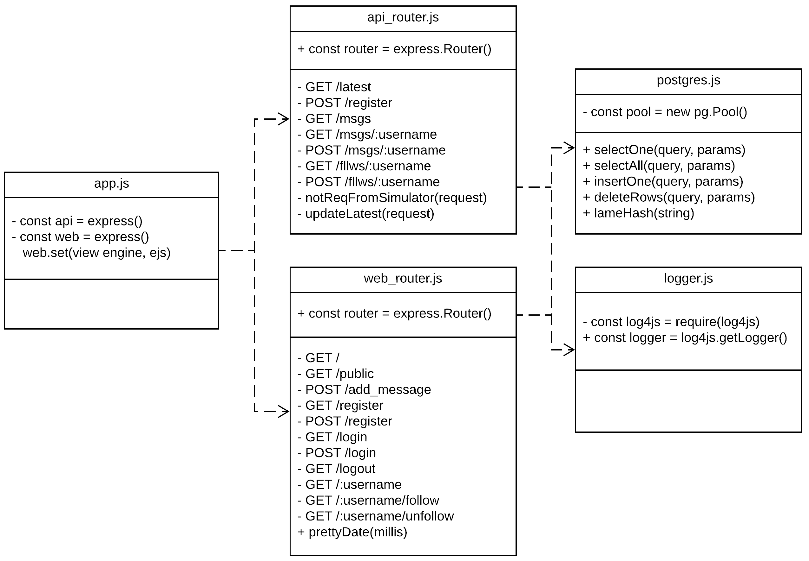
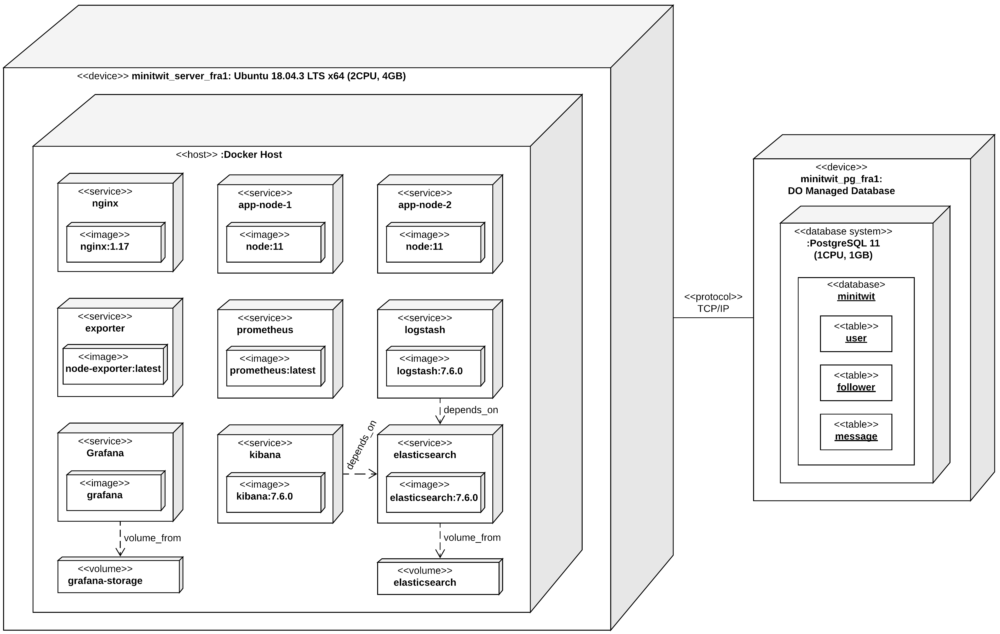
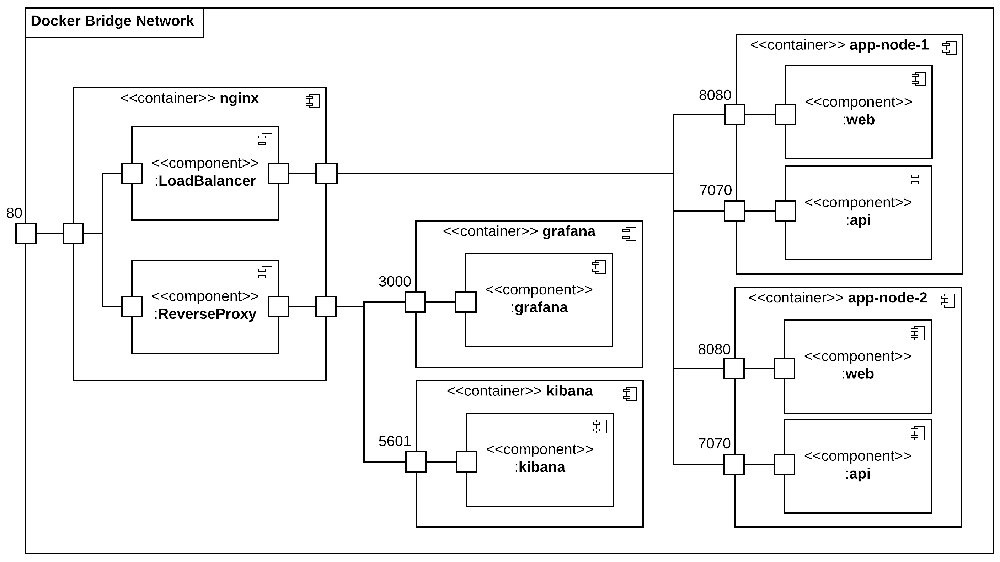
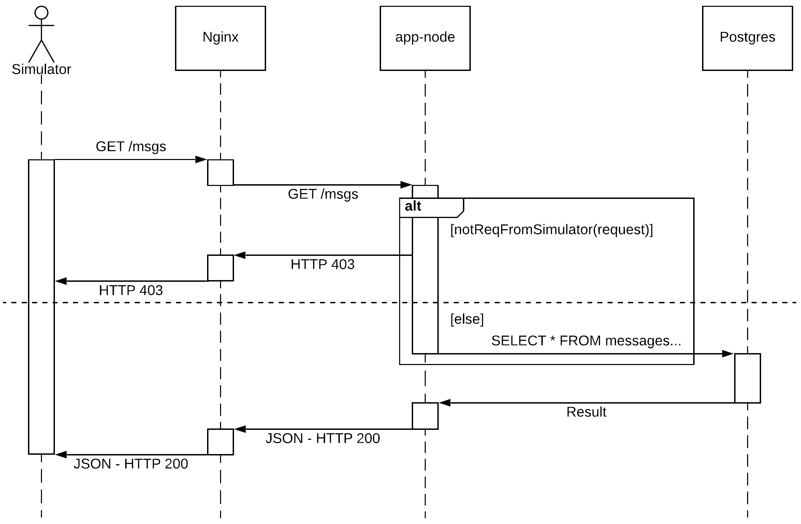
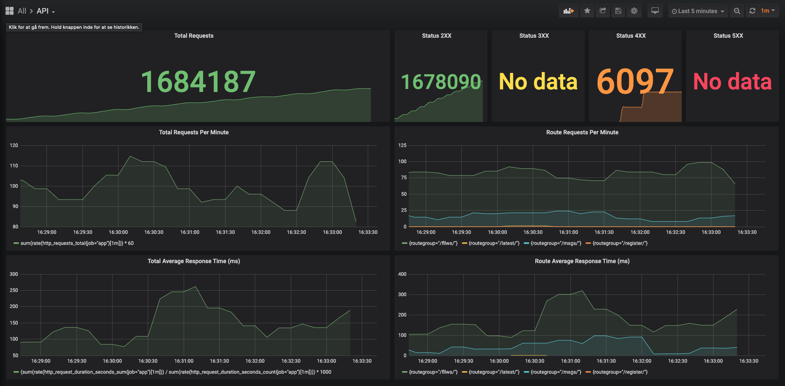
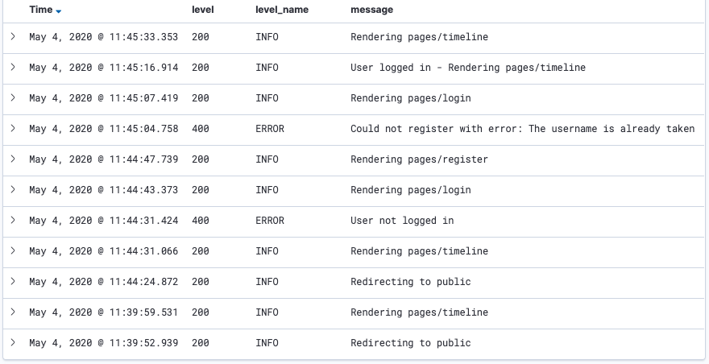
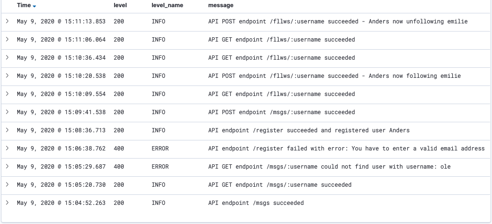

#minitwit.dk - Group C - U Buntu?

###DevOps, Software Evolution and Software Maintenance,MSc

###_Authors:_
###Emilie Rafn-Hamalainen (emir@itu.dk)
###Esben Gade Hellmuth (eshe@itu.dk)

###_Course Manager:_
###Helge Pfeiffer

###IT Univeristy of Copenhagen

###_KSDSESM1KU_

###May 2020

#System's Perspective

##1.1  System Design
*Written by Emilie*

Our Minitwit application consists of a web app and an API. The web app is a simple version of Twitter where a user can register a profile, log in, and post a message for everyone to see. The users can follow and unfollow each other. The API has endpoints with same functionality as the web app. However the API can only be used with a specific authorization key. The application is developed in JavaScript using Node.js as the run-time environment, Express.js as the web framework and EJS as the view engine. The database behind the application is a PostgreSQL database. 

_Figure 1.1 - Class diagram of the Minitwit app._

Figure 1.1 shows the module structure of the Minitwit application. It consists of five _.js_ files which are defined as class objects in the diagram. We decided to model it as a class diagram, even though JavaScript modules are not exactly the same as classes in an OO language. The diagram shows that _app.js_ depends on *api\_router.js* and *web\_router.js* to execute. The diagram does not show the EJS templates, but it shows that the _app.js_ file sets the view enigne with the line: _web.set(view engine, ejs)_s. This makes it possible for the *web\_router.js* to render the pages when necessary. 
It also shows that both the *api\_router.js* and *web\_router.js* depends on both _postgres.js_ and _logger.js_ to execute. The _postgres.js_ file contains database helper functions where the _logger.js_ file configures the setup of the logger to output the logs the way we wanted. These files makes it possible for both router files to make queries to the database and log necessary messages to the ELK stack. 

##1.2 System Architecture
*Written by Emilie*

The Minitwit system consists of the Minitwit application and a lot of other services. These services are used to direct traffic inside the system, aggregate and present logs, and monitor the system. The system is connected to a PostgreSQL database which the Ubuntu server communicates with, over the TCP/IP protocol. 

_Figure 1.2 - Instance Level Deployment diagram of the Minitwit system._

Figure 1.2 is a deployment diagram of the Minitwit system. The system has two devices: The Ubuntu server and a managed PostgreSQL database. In our case the Docker Host is the Ubuntu operating system, but it could also have been a virtual machine running inside Ubuntu. Another service that is not the focus of this diagram is the Docker Daemon which runs alongside- and orchestrates the containers. The Docker containers are represented as services in the diagram. All services and their functionalities are described in section 1.3. For each service the diagram shows which image and version the container is built. 

The diagram also shows which database system that is used and which tables the database has. The communication between the Ubuntu server and the managed database system is over the TCP/IP protocol. It is worth mentioning that this communication is over a private network inside the data center. This means that the connection is more secure and also much faster than going over the public internet. 

_Figure 1.3 - Component diagram of the Docker Bridge Network._

Figure 1.3 is a component diagram that gives a deeper understanding of the internal Docker Bridge Network. It shows the different Docker containers in the network that are publicly accessible through port 80 on Nginx. No container except Nginx is directly accessible from outside the internal network. The Nginx container has both a load balancer component and a reverse proxy component which connects to four different containers. The differentiation between the load balancer and the reverse proxy is only for illustrative purposes as they are really the same component. Access to the Grafana and Kibana containers on their port 3000 and 5601 respectively are controlled by the reverse proxy. The next two containers are identical and are called app-node-1 and app-node-2. These are controlled by the load balancer. These two containers both have the web app and the API running. The app nodes are open for internal communication on port 8080 for the web app and port 7070 for the API.

##1.3 System Dependencies
_Written by Esben_

###1.3.1 Web App
_Developed and written by Emilie & Esben_

####1.3.1.1 Node.js & JavaScipt 
Node.js(Node) is a JavaScript run-time built on Chrome's V8 JavaScript engine. It uses an event-driven, single-threaded, non-blocking I/O model, which makes it efficient and lightweight. The non-blocking I/O model allows a thread to work on a task, while waiting for another task to finish, using asynchronous functions. The benefit of this approach versus a multi threaded approach(Java, C# etc.) is low memory utilization as well as not having to worry about problems associated with multi threaded applications.

The above paragraph is sort of the usual sales pitch for Node. A closer look tells us that Node is not quite single-threaded after all. It is true that the main process, also called _eventloop_, is only using a single thread. But Node also relies on a _worker pool_ of threads to handle network, file system and CPU heavy tasks like cryptography.

Still, it only uses a single thread to handle all incoming requests, opposite to typical "one-thread-per-client" systems. This is one of the reasons Node scales really well. Another reason is that the low CPU and memory utilization makes it a perfect candidate for horizontal scaling with a cluster of small nodes.

We chose Node and JavaScript as our run-time and programming language because of multiple factors. After reading about scaling of Node we were all exited about the possibilities. Only one of us had a bit of experience with Node beforehand, but for all of us it was an opportunity to learn something new. And finally, it is obvious that Node is extremely popular which makes it an interesting technology to be familiar with. Both in terms of our work life and possibilities, but also as a tool to whip up quick prototypes taking advantage of the vast number of cool packages in the ecosystem.

####1.3.1.2 Express.js
Express.js(Express) is a Node web application framework. Back when it was first developed Node was still in its infancy, and Express was almost a necessity to get a web application up and running. As Node has matured Express is becoming less essential, but it still does offer some core features that can make development a lot easier. The main one is the ability to introduce middleware in the Express app, and the fact that there exists tons of middleware packages in the ecosystem. In our case we plugged in a view engine, static file serving, a form URL encoder, a JSON parser, a cookie parser, session storage and Prometheus(section 1.3.5.1) middleware with a single line of code respectively.

Other than comparing Express to pure Node, we also looked at another new and popular web framework, Koa, which is made by some of the original Express developers. From reading about it, it seemed like we would be able to get to the same result. But we ended up choosing Express over Koa because of almost infinite amount of packages and online resources that exists for Express.

####1.3.1.3 Node Postgres
Node Postgres, also known simply by its package name _pg_, is a collection of Node modules for interfacing with a PostgreSQL database(section 1.3.3.2). It offers everything you would expect from a database library, but most notably it supports async/await, prepared statements and has built in connection pooling.

Choosing _pg_ is easy as there are no alternatives worth mentioning.

####1.3.1.4 EJS
EJS is a view engine and simple templating language that lets you generate HTML markup with plain JavaScript, and that plugs directly into Express as a middleware. When a page is rendered by Express you simply pass along the parameters required for that specific template, e.g. a username, a list of tweets etc. It also supports including templates into other templates which is useful for the header and the footer.

Before choosing EJS we did a small test of a similar template language called Pug(formerly Jade). 
Pug has their own indentation based "simplified syntax" for writing HTML which looks cool in small example snippets, but became rather cumbersome when the template grew.

####1.3.1.5 Express Prometheues Middleware
Express Prometheues Middleware is a wonderful little package that saved us from a bunch of manual coding. Like the name suggests it plugs into Express, where it will send _http_requests_total_ and _http_request_duration_seconds_ to Prometheus for every endpoint in the application. With only 1 line of code!

The data is used in Grafana(section 1.3.5.3) to create dashboards that visualize the individual endpoints' performance and number of requests(section 2.5).

####1.3.1.6 Log4js-node & Logstash HTTP
Log4js-node is a conversion of the popular Log4js framework, that has been specifically tailored for Node. In practice it means that all browser related functionality has been stripped.

The framework comes with a lot of handy features like colored logging, file appending, configurable log message layout etc. However, the reason we chose it was because it comes with an appender from the same development team called Logstash HTTP. The appender makes it easy to send JSON encoded log messages to Logstash(section 1.3.4.2) over HTTP.

###1.3.2 Nginx
Nginx is a high performance web server, reverse proxy and load balancer all in one. It is estimated that Nginx powers about one third of all web applications[1] which speaks to just how capable it is.

The biggest competitor with the same capabilities is the Apache HTTP Server which has a more or less equal market share depending on who you ask. The biggest difference between the two is actually the same as discussed earlier between Node(section 1.3.1.1) and multi threaded applications. Apache HTTP uses the "one-thread-per-client" method of connection handling, which gives it a very clear limit to the amount of concurrent connections it can handle. Nginx on the other hand uses an event loop much like Node. It was invented specifically to solve problem of handling more connections with less threads, also known as the "C10K" problem. We chose Nginx for its potential for high performance but also because feels like a more modern and cool technology.

Later we became aware that there are other reverse proxy/load balancer alternatives like HAProxy and Traefik. They do not work as web servers, feature static content hosting or has built in caching like Nginx. But all of those are features we did not need in the end anyway.

###1.3.3 Persistence
During the course our Minitwit system has been using two different technologies for persistence. We'll take a deeper look at the process of shifting between them in section 2.4.

####1.3.3.1 SQLite
SQLite is a C-language library that implements a small, fast, full-featured, SQL database engine. SQLite stores all its data in a single file on disk and does not feature caching. It also does not perform well with a high number of concurrent requests compared to more advanced database engines. We chose to use it in the first version of our refactored application because it was used in the legacy application that we inherited.

It was the plan from the beginning to swap it with something more advanced and scalable at a later point.

####1.3.3.2 PostgreSQL
Postgres is a powerful and advanced SQL database engine. It is relational and SQL based like SQLite which meant that we did not have to reinvent the existing schema to use it.

Because of lessons learned (and described in section  2.4 & 3.1) we chose to go with a managed database solution from our cloud provider DigitalOcean, because of their free daily backup feature. We chose Postgres over MySQL as their managed MySQL solution does not support connection pooling or query statistics(which is a really helpful tool to monitor and fine tune queries).

###1.3.4 Logging
For a logging solution we went ahead with the ELK stack that was showcased in the course. We did have a quick look at an alternative called GrayLog, which is more of an all in one solution. We chose the ELK stack because we thought it would be fun with a more hands-on approach.

####1.3.4.1 Elasticsearch
Elasticsearch is the persistence layer of the ELK stack. At its core it's a document store, also commonly referred to as a "NoSQL" database. But that's not the exiting part of Elasticsearch. Like the name suggests it is geared towards searching and does so extremely well. Especially full-text search which is something that is almost impossible to do in traditional relational databases without a huge performance hit. The full-text search capability makes it perfect for filtering log messages which is essentially just text. It also does well with filtering and sorting fields with information about log levels, timestamps etc.

####1.3.4.2 Logstash
Logstash is a log aggregator that collects data from various input sources, executes different transformations and then ships the data to various supported output destinations, in our case Elasticsearch.

####1.3.4.3 Kibana
Kibana is a visualization layer that works on top of Elasticsearch, providing us with the ability to analyze and visualize the data. It can be used for simply monitoring and searching for specific log messages and time frames. But also to visualize with graphs and charts the amount and timing of log messages matching specific filters.

###1.3.5 Monitoring
For a monitoring system we also went with the solution that was showcased in the course. Generally there are two types of monitoring systems; those where services _push_ metrics to the monitoring system and those where the monitoring system _pulls_ metrics from services. Prometheus falls in the latter category. There is a whole discussion online whether one is superior to the other, which we are not gonna get into. It seems like the disadvantages of both can be worked around. Let's call it even.

####1.3.5.1 Prometheus
Prometheus is a monitoring system that collects metrics from configured targets at given intervals, evaluates rule expressions and displays the results. It comes with it's own flexible query language PromQL, specifically made for it's multi-dimensional (time series) data model.

####1.3.5.2 Prometheus Node Exporter
Node Exporter is a small Docker container created by the Prometheus team, that exports system metrics from the machine it is running on. It exports every conceivable metric including CPU usage (for each CPU), memory usage, file system space available and read/write speeds, network I/O etc.

####1.3.5.3 Grafana
Even though Prometheus has a built in way of visualizing data, it is far from as beautiful and versatile as the one offered by Grafana. In Grafana it is easy to create colorful and informative dashboard leveraged by the power of Prometheus and PromQL.

###1.3.6 Docker
Docker is a platform that uses virtualization to deliver software in packages called containers. The containers are isolated from one each other and bundle their own software, libraries and configuration files. The containers are able to communicate with each other both through the host network, but also (preferably) through an internal Docker network.

It is no secret that Docker is the de facto standard for containerization. Another option we were looking at (and which was taught in the course) is Vagrant. Vagrant is different in that it bundles a whole operating system in the image where Docker containers use the kernel of the host system and only bundles whatever is needed on top of that.

We chose Docker over Vagrant because of the smaller image sizes that are easier to distribute as well as the lower resource consumption that is the result of leveraging the hosts' operating system.

###1.3.7 Travis CI
Travis CI is a hosted continuous integration/delivery service used to build and test software projects hosted at GitHub. We also gave Circle CI a quick look but couldn't find a good reason to choose one over the other.

We decided not to look at self hosted systems, e.g. Jenkins, unless it would turn out to be absolutely necessary.

##1.4 Important Interactions of Subsystems
_Written by Emilie & Esben_

Granted there are many interactions between subsystems in our system, and most if not all of them are important to some extent. There are the interaction between the app, Prometheus and Grafana. And the interaction between the app, Logstash, Elasticsearch and Kibana. Those however were mostly given beforehand by the convention of how to use those subsystems. The interaction we focus on in this section is the one which we have had most the most freedom to design and develop ourselves; the interaction between a client, the load balancer, the app nodes, and the database.

_Figure 1.4 - Sequence Diagram of the simulator sending a request to the API._

Figure 1.4 is a Sequence Diagram of the interactions between the simulator and the three subsystems Nginx, app-node, and Postgres. The simulator sends the GET request to Nginx that should return all messages. Nginx then forwards the request to one of the app-nodes by load balancing between them. Because the request is to the API the app-node will check if the request is sent from the simulator by checking if the the Authorization Header is set to the right key. This is done in the `notReqFromSimulator()` method. If this returns false then the app-node will respond with a HTTP 403 status code which will then be forwarded from Nginx to the simulator. If the method returns true the app-node will send a query to the Postgres database to get all messages. The database returns the result which then will be forwarded as JSON together with a HTTP response status 200. The same response will be forwarded from Nginx to the simulator which ends the sequence.

One interesting thing to note in the diagram is the processes in Nginx and the app-node that are not running for the entirety of the interaction. This is because both Nginx and Node is single threaded as discussed in 1.3.2 and 1.3.1.1. When a request is waiting for a response from an app-node or Postgres respectively, they are parked until a callback is received and then pulled back into the event loop again.

#2 Process' Perspective

##2.1 Team Organization and Interaction
_Written by Emilie_

When developing the features we have, as developers, either worked on them individually or working together on the same feature. But in either cases we have discussed together the expected functionality and outcome of the feature beforehand. When bumping into problems we have communicated the issues to each other in return for help. 

The reason there is only two names on the report is the fact that there has been a fallout in the collaboration with the other half of the group. This is discussed in more detail in section 3.3.

Since we have been only two to develop the Minitwit system it has been quite easy to distribute the development between each other as there have been enough work to go around.

##2.2 CI/CD Chains
_Developed and written by Esben_

Our continuous delivery(CD) pipeline has two components, Git(section 2.3) and Travis(section 1.3.7). The stages of the pipeline are as follows:

* A commit is either pushed directly to master, or a branch is merged into master.
* Travis is triggered by the new commit and clones the master branch. 
* Travis loads variables from the project settings; IP and port of the server, the deployment directory on the server and a private key for accessing the server with SSH. The private key is encrypted with a Travis public key so that only Travis can read it.
* The master branch is pushed to a remote repository that exists on the server using Git over SSH.
* Travis connects to a bash shell on the server where it uses _docker-compose_ commands to replace the currently running containers with new containers build from the updated master branch. 

We realize that this is very close to the least that would fit the definition of a CD pipeline. And that we don't touch on CI at all; testing, static code analysis etc. We would have loved to take a deeper dive in this end of the pool, maybe using DockerHub and SonarCube, had we had the time.

##2.3 Version Control
_Written by Esben_

We have been using a single remote repository hosted on github.com, cloned to our local machines and synchronized when needed.

We have been using a simplified version of Git Flow. Where we only use the master branch and feature branches. The master branch works like the develop branch in Git Flow. We branch out from master into feature branches when working on new features. When a feature is ready a pull request (PR) back into master is made. On this PR all team members will do a code review (CR), and either approve the PR or suggest changes. When a PR is approved by all team members, it is rebase merged into master. Rebase has been chosen to end up with a single pretty string of commits instead of ugly merge commits.

Releases is made from github.com and tagged with a version number. We have decided that while the project is under development, and not in production, we will not use release and hotfix branches. Keeping it simple for our own sake.

Contributions ie. pushed commits should be well thought through, tested and must not break the current system. Commits should be documented both in code and in the commit message.

To increase visibility and knowledge sharing in the team we have decided that all contributors will do CR on PRs. The last person to approve will do the merge/rebase.

##2.4 Persistence
_Developed and written by Esben_
The first versions of our Minitwit system was still using the same SQLite database as the legacy system we inherited. It was our plan from the beginning to implement a more advanced persistence layer at a later point.

After we decided to go with a Postgres database(section 1.3.3.2), work began to develop a database abstraction layer and we decided to use a Node ORM library called Sequelize. At the same time we formulated a plan on how to make the switch to the new database as seamless as possible. The plan was the following:

1. Implement Sequelize alongside the SQLite implementation.
2. Execute write queries in both the SQLite and the Postgres database.
3. Make a dump of all the data in SQLite timestamped before the first write in Postgres.
4. Load the dump into Postgres.
5. Implement Sequelize for all queries and remove the SQLite implementation.

We thought that was a pretty cool plan. And we would have gotten away with it too, if it weren't for us meddling kids[2]. Unfortunately, we accidentally deleted our SQLite database, which was stored in the _/tmp_ directory, by restarting the server.

At the same time, the development on the database abstraction layer had stalled, so we decided make the now unavoidable downtime as short as possible by doing a refactor of the application from using SQLite to using the Postgres database without Sequelize. If you disregard the total loss of data, we were back to normal in 1.5 hours. 

##2.5 Monitoring
_Developed and written by Esben and Emilie_

Our system is monitored by Prometheus collecting metrics from our API and Prometheus Node Exporter. The data we collect form our API is the number of requests for each endpoint, the average response time, and the HTTP status codes. The data we collect from our Prometheus Node Exporter are everything needed to know about the system running our services for example information about our CPU usage, memory, disk etc. For visualizing the data that Prometheus collects we use Grafana. 

_Figure 2.1 - API monitoring in Grafana._

Figure 2.1 is a screenshot of our API dashboard in Grafana. It counts and graphs the amount of requests per endpoint and in total, graphs the average response time per endpoint and in total, and counts occurrences of the different classes of HTTP response codes.

The two endpoint specific graphs is something we're particularly proud of. It took us two days of deep googling and trial and error to get it right. The issue was that the use of URL parameters was essentially giving us a line in the graph for each request e.g. _/msgs/John_, _/msgs/Annie_ etc. We finally figured out how to relabel the metrics in the Prometheus configuration.
This beautiful little piece of regex did the trick: `(^/[^/]*).*`

##2.6 Logging
_Developed and written by Emilie_

The logging in our system is implemented in each endpoint in the web app and the API. In the web app we log every time something new happens. That is each rendering of a page or a redirection to another page. We also log all errors detected. In the API we also log every action. We log each response. That is both errors and successes.
For log management we are using an ELK stack which consists of Elasticsearch, Logstash, and Kibana. These three projects send all logs from the system to one location, and then visualize the logs. Logstash is used for log aggregation which collects and process all the logs we send with Log4js, and then sends it to Elasticsearch. Elasticsearch then stores the logs which will be visualized in Kibana by sending queries to Elasticsearch.

_Figure 2.2 - Log messages from the web app in Kibana._

The log messages is layout in a way that makes them easy to read. The web app's log messages describe what has happened and is tagged with the endpoint that has logged the message. Figure 2.2 is a screenshot of the web app logs visualized in Kibana. The response status codes can be read under the headline "level". The names of the response status is under the headline "level_name" and the log message under the headline "message". It is clear that the logs describe the web app actions performed. This is amongst other because it describes that it renders the page it is navigating to next in the log message. It is also possible to read what has gone wrong when errors occur because the error messages describe exactly what has been attempted or gone wrong. 

_Figure 2.3 - Log messages from the API in Kibana._

Figure 2.3 shows how the logs from the API looks like. The log messages are implemented in a way that makes it possible to see that the logs comes from the API. All logs from the API has "API" plus the endpoint name in the start of the log message. This it to make it even easier to differentiate the logs from the web app and API. The API logs are, as the web app logs, easy to read because the message clearly describe what has happened and which endpoint the log message comes from. 

##2.7 Results of Security Assessment
_Performed by Emilie and Esben and written by Emilie_

In our own security assessment we found that we accidentally had left port 3000 open which runs the Grafana service. As soon as we found out we closed this port so it would only be accessible from Nginx on port 80. By reading Group B's Security Assessment of our system we discovered that they had only found that port 80 and port 22 was open. We were happy to see that we had managed to close port 3000 before group B made the port scanning. For port 22 we disabled login via password to avoid an attacker trying to brute force the password. This means that it is only possible to login on SSH with a private key. 

For following paragraph it is needed to show our SLA:

* Uptime: 99\%
* Average Response Time: 200 ms
* Time to Recover: 2 hours

We have discovered from Group B's monitoring that we violated our SLA. Their monitoring results showed that our Uptime was 100\% and Time to Recover was 0 seconds. These two points lived up to the SLA. The Average Response Time was the one that violated the SLA as it was up on 1.87 seconds which is almost 10 times more than what our SLA stated.
The main reason for this is because we only have one droplet and Elasticsearch uses almost all the accessible RAM on our server. If we weren't on a student's budget we would have been more generous with servers. The Minitwit application and the ELK stack would have been put on their own severs which would result in the ELK stack not using resources from the Minitwit application. In theory the load balancing would help on the response time but in practise this is not the case. This is because both instances are on the same server. Instead the load balancing supports the Minitwit application's availability.

Furthermore Group B discovered that we had passwords for our database and Kibana in the code. This is of course not acceptable at all. Neither were the Kibana password changed from the default password which also is something that needs to be changed. In a real world situation we would have been saved by the fact that our repository would have been private and in that way unauthorized people would not have been able to see our code. But this still does not mean that it would have been secure to have the credentials in the code and it is a misdemeanor from our side. 

##2.8 Scaling and Load Balancing
_Developed and written by Esben_

The major components in our scaling and load balancing setup are Nginx(section 1.3.2) and Docker(section 1.3.6). 

Nginx is the entry point to the system and is used to load balance between the two app nodes. For the API endpoint the default _round robin_ balancing algorithm is used. This is possible because the API is stateless.

The web app however requires another method because it uses session cookies between the client and the server for authentication. There are multiple ways to deal with this problem. One is using another form of authentication, e.g. _JWT_ tokens, and put the same decryption key on all the nodes. Another more advanced solution is to have a shared session cache that all the nodes communicate with. The method we chose was the _IP hash_ load balancing algorithm. It directs clients to a node based on the client IP address. This means that the same client will always reach the same node. It is not a perfect solution in that it can produce uneven load patterns, but on the other hand it is really simple.

Scaling was done with docker by duplicating the app service in the docker-compose configuration, as well as adding the new node to the Nginx configuration. It is a fairly easy way to scale up and down, but of course it could be made cooler with more advanced tools like Docker Swarm, Terraform, Kubernetes, or even automated using the DigitalOcean API.

Since we ran all our containers on a single server, the scaling and load balancing did not make much sense from a practical performance perspective. It did however give us redundancy and availability in case a node would fail.

#3 Lessons Learned Perspective

##3.1 Backing up data
_Written by Esben_

This lesson was learned in the hardest of ways. As described in 2.4, we accidentally deleted all of our data, which would have been a true catastrophe in a real world scenario. In this case it was less of a catastrophe but still an annoyance as we were really proud of not having a single error in the simulator charts beforehand.

The event made us rethink our approach to persistence, and made us choose a managed database solution for its easy, free and probably reliable daily backup feature. 

##3.2 Security
_Written by Emilie_

From the Security Assessment we both learned some obvious lessons and some new lessons. The most obvious lesson, which we are somewhat embarrassed about, is that we had written login credentials in the code. This is one of the lessons that are crucial, that we should have thought about when writing our code. In a real world scenario this could have created some serious issues for a company. This is a lesson learned from embarrassment that we will remember and hopefully never do again. 

Another lesson that we learned from the security assessment is about the response time. We learned that our Minitwit application was slower than anticipated. This came as a surprise for us, but after thinking it through it made sense to us. This happened, as explained in section 2.7, because of a service using almost all the the RAM on our server. From this we have learned that in the real world it would be preferable to have multiple servers to run our services on so the Minitwit application will not have limited RAM to run on. This of cause also requires a larger budget since multiple servers will cost more but we can expect that this is necessary in a real world scenario.

##3.3 Teamwork
_Written by Esben_

The teamwork in the group has been a double-edged sword. The collaboration between the contributing parties has been excellent. Both communication, knowledge sharing, and working together to solve problems has been working flawlessly. On the other hand the other part of the group has been isolating themselves, not delivering what was promised, and not communicating about it. They did make an attempt at developing the database abstraction layer but the feature was never finished.

We have been somewhat naive in thinking that they would come around eventually, but realize now that we should have done something more drastic about it earlier in the process. 

We invited them to help write the report following the suggestion from Helge. They promised to help us write it but did not deliver on this either. The day before the deadline they let us know that they wouldn't be contributing to the report anyway.

##3.4 Technologies
_Written by Emilie_

Furthermore we have learned a lot of new technologies that we find very useful for future projects. This includes the monitoring technologies Grafana and Prometheus. These technologies has made us realized how helpful it can be having the possibility to get an overview over the usage of the system. This includes amongst other the requests that can give insight in the user interactions of the application. Also the overview of the CPU usages help giving an idea of what happens when for example a system gets very slow. 

Another technology is the ELK stack. We did know about logging before this course, but the implementation of an ELK stack (or other log management technologies) taught us how helpful good logging actually can be. Having structured and specific log messages of the different actions in an application helps finding errors in the system and find potential tried attacks. 

An area that we have definitely learned more about is containerization which have been accomplished with Docker. It has been extremely useful during development that we could run the system, the same as in production, with a single command. 

#References
[1] Netcraft, [April 2020 Web Server Survey](https://news.netcraft.com/archives/category/web-server-survey/), Online, accessed 09-05-2020.

[2] Urban Dictionary, [And I would have gotten away with it too, if it weren't for you meddling kids](http://and-i-would-have-gotten-away-with-it-too-if-it-werent-for-you-m.urbanup.com/447929), Online, accessed 10-05-2020.